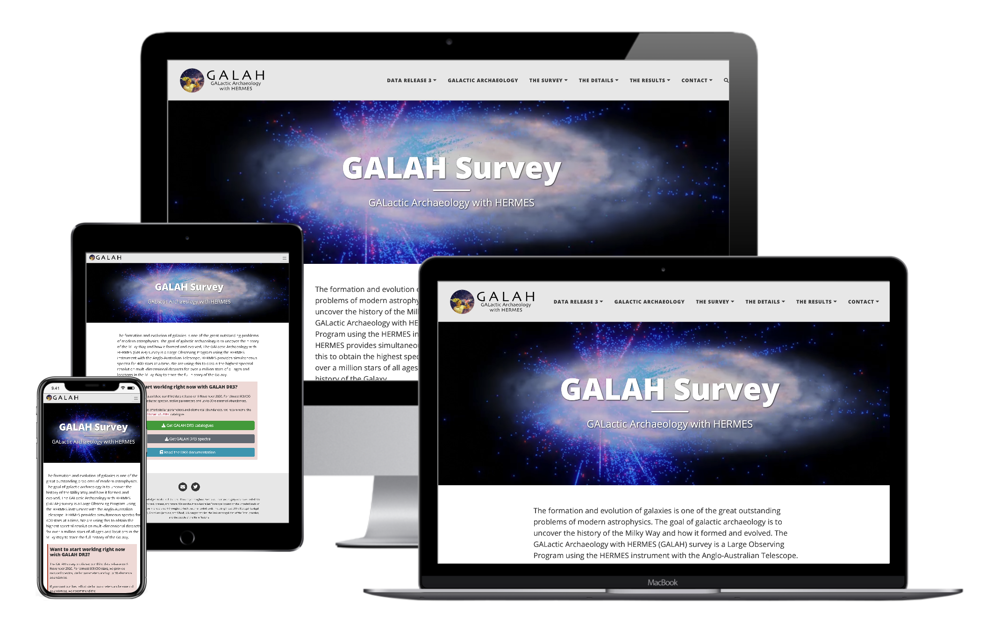

[](https://github.com/the-galah-survey/the-galah-survey.github.io/actions/workflows/publication_updater.yml)

## Welcome to the development page of the GALAH Survey website



For the website itself, go to: http://galah-survey.org

Please address requests via email to Jeffrey Simpson ([jeffrey.simpson@unsw.edu.au](jeffrey.simpson@unsw.edu.au)).

# Instructions for editing the website

## Editing the existing pages

There are a number of main pages and subpages, all with the `.md` suffix. These can be safely edited, except for [`survey/people.md`](./survey/people.md), [`science/galah_publications.md`](./science/galah_publications.md) and [`science/external_publications.md`](./science/external_publications.md), which are generated via scripts.

### Editing the people page
**Do not edit the people.md file directly**. Edit the `assets/data_tables/people.csv` file. There is a Github Action that will automatically run and update the people.md when this file changes.

### Editing the publication pages
**Do not edit `galah_publications.md` or `external_publications.md` directly**. Their content is generated via a script that pulls the listings from ADS libraries. There is a daily Github action that automatically checks for new or updated papers.

## Editing the navigation menus and the footer section

The links in the menu and in the footer are all configured in the main configuration file, [`_config.yml`](./_config.yml). Specifically, the parameter `navbar-links` inside the file is used to define the top navigation menu, and the `author` parameter just below it is used to define the information that should be shown in the footer.

## How to edit the style of the website

The general layout of the pages can't be changed easily.  But things like colour, spacing, fonts, and any other CSS style can easily be changed by adding CSS rules to the [`beautifuljekyll.css`](assets/css/beautifuljekyll.csss) file. For example, you can change the size of the text, or the background colour of the navigation bar, or the colour of the text in the footer.

Note that the template was designed in a way such that it changes drastically when you view it on a big screen (laptop) vs a small screen (phone).

## How to add new pages

To add a new page at the URL `http://the-galah-survey.github.io/example`:

- Add a file named `example.md` to the root directory of this repo
- The file **must** begin with two lines of three dashes (aka YAML front matter) in order for this new page to use the template. In other words, each file must begin with the following two lines

    ```
    ---
    ---
    ```
- You can write either in markdown or in pure HTML
- If you want to add images, I suggest you place all the images inside the [`img`](./img) folder and refer to images from there.
- In between the YAML front matter (between the two lines of dashes), you can specify a few parameters:
  - `title`: Gives a nice big title to the page
  - `subtitle`: A subtitle to the page

# Credits

This website is powered by **[Beautiful Jekyll](https://beautifuljekyll.com)**, a ready-to-use template to help you create a beautiful website quickly.

This README file is adapted from [reconhub.github.io](https://github.com/reconhub/reconhub.github.io). 
